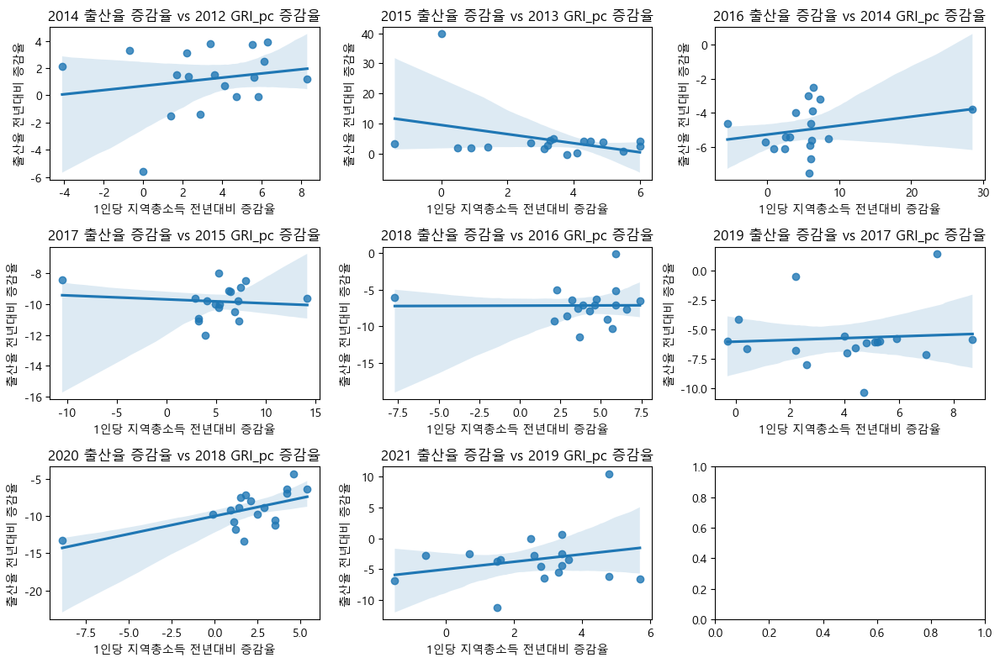

# :pushpin: Income/Liabilities - Marriage-Unmarried Status Analysis
>부채와 소득이 미혼율에 미치는 영향

---
## Overview
### 이 부분에서는 부채가 미혼율에 미친 영향을 분석합니다. 이 주제에 대해 자세히 탐구하도록 하겠습니다.

## 1. 데이터 수집 및 전처리
### 온라이에서 자료를 수집하였습니다.

### 1.1. 데이터 수집

#### `미혼율`

>[한국여성정책연구원](https://gsis.kwdi.re.kr/statHtml/statHtml.do?orgId=338&tblId=DT_1IN0508)    

#### `평균부채`
> [한국은행 가계금융-복지조사](https://www.bok.or.kr/portal/search/search.do) 

#### `1인당 지역총소득(GRI per capita)`
> [KOSIS](https://kosis.kr/statHtml/statHtml.do?orgId=101&tblId=DT_1C86&conn_path=I2) 

---

### 1.2. 전처리

#### `전처리`
### 한국여성정책연구원 웹사이트에서 데이터 수집

|  | **원본** | **전처리** |
| :-- | :-- | :-- |
| **항목** | 6 | 1 (미혼) |
| **성별** | 3 (전체, 남, 녀) | 1 (전체) |
| **연령별** | 17 | 1 |
| **시점** | 8 | 8 (1985-2020, 5년 간격, 30-34 세)|
|  |  |  |

### 데이터가 5년 간격으로 존재하기 때문에 2012-2021년 기간의 매해 미혼율을 파악하기 어려움. 그러나 선형 추세선을 사용하여 추정함. 추세선 R^2 = 0.9711. 2012-2021년 미혼율을 추정함.
| Year | Unmarried Ratio |
|------|----------------|
| 2012 | 0.34           |
| 2013 | 0.36           |
| 2014 | 0.37           |
| 2015 | 0.39           |
| 2016 | 0.40           |
| 2017 | 0.41           |
| 2018 | 0.43           |
| 2019 | 0.44           |
| 2020 | 0.46           |
| 2021 | 0.47           |

### Debt. People Under 30
### 30세 미만의 2012 -2021 평균부채 데이터
|      | 30세 미만. 단위: 만 원|
|------|----------|
| 2012 | 1283     |
| 2013 | 1393     |
| 2014 | 1558     |
| 2015 | 5323     |
| 2016 | 1593     |
| 2017 | 2385     |
| 2018 | 2397     |
| 2019 | 3197     |
| 2020 | 3479     |
| 2021 | 3550     |

### GRI per capita
## KOSIS 에서 데이터 수집
특정 연도(예: 2021년)의 시도별 지역총소득 데이터를 수집\
특정 연도 시도별 합계출산율과 그 해의 시도별 지역총소득을 Scatter Plot 을 사용해 Plot 작성.\
note: 세종특별시는 2013년부터 데이터 존재.\
지역총소득과 합계출산율은 대체적으로 약한 음의관계를 보이나 Correlation이 거의 없다고 봐도 무방.\

2년전 지역총소득 전년대비 증감률과 합계출산율 전년대비 증감율 관계탐구. 예: 2014년의 2년전, 즉 2012년\
지역총소득의 전년대비 증감율이 2014년 합계출산율 전년대비 증감률과 어떤 관계를 보이는지 탐구.

결과:

## Limitations and Constraints

여러가지 한계점이 있었지만 가장 큰 한계점은 바로 데이터가 충분치 않았던 것입니다. 미혼율 데이터는 5년 간격으로밖에 없어서 2012-2021년 기간에 있어서 디테일한 분석에 어려움이 있었던 것이 사실입니다.

## Tools

**사용한 도구:** Pandas, Numpy, Matplotlib, Python
