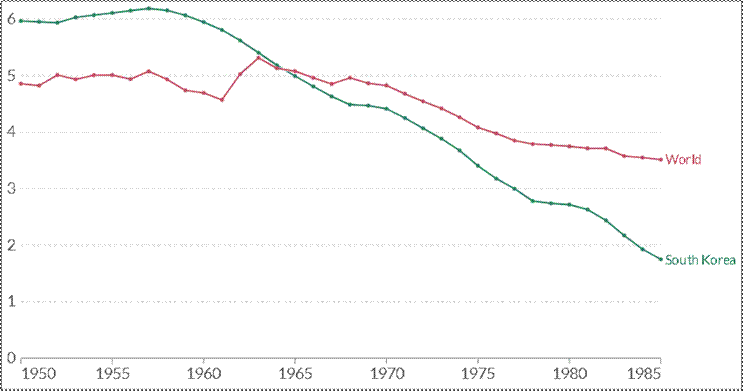
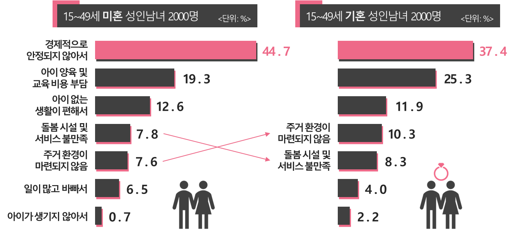
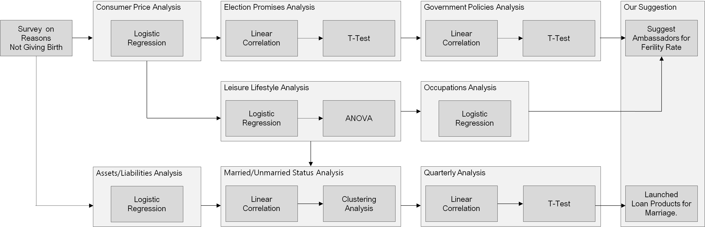

## :pushpin: Intro
>저출산 지원 정책 수립을 위한 저출산 요인 분석   

---

#### `목적`
>저출산 문제 분석 및 정부에 정책 제언 제공  

---

#### `동기`
>저출산의 사회적, 경제적 영향 해소와 출산율 증가  

---

## 1. Project Period & Role
>제작 기간: 4주(2023.04.12 ~ 2023.05.02)   

---

#### `장상윤`
>이메일: jangapp21@gmail.com 
>깃헙: https://github.com/jangsangyoon13 
>데이터 전처리 및 분석 
>프로젝트 구성 

#### `정구열`
>이메일: yeol512@nate.com 
>깃헙: https://github.com/zzang910 
>데이터 전처리 및 분석 
>프로젝트 발표 

#### `한태성`
>이메일: hantaeseong4@naver.com 
>깃헙: https://github.com/hantaeseong00/ 
>데이터셋 구축 및 시각화 
>통계 검증 
>크롤링 
>보고서 작성 

#### `황준하`
>이메일: junatrout27@gmail.com 
>깃헙: https://github.com/JunaHwang 
>팀장 
>데이터 전처리 및 시각화 
>프로젝트 발표 자료 준비 

#### `홍재연`
>이메일: yoandjung1@gmail.com 
>깃헙: https://github.com/jaexxyoyo 
>데이터 수집 및 전처리 
>종속 변수 선정 

---

## 2. Development Environment & Utilized Skils
>Python 3.9.13 
>R version 4.2.3 
>Windows 10 Pro 
>Intel(R) Core(TM) i7-9700 CPU @ 3.00GHz 
>RAM:8589934592 
>Intel(R) UHD Graphics 630 

---

#### `Utilized  Skils`
>데이터 분석 라이브러리    
	- dplyr, tidyr, tidyverse, tsibble, moonBook, car    
	- numpy, pandas, scipy.stats    
	
>웹 크롤링 라이브러리    
	- Beautiful Soup, Selenium,	Requests    
	
>시각화 
	- matplotlib, seaborn, Axes3D, WordCloud, folium    
	- ggplot2, plotly, gganimate    

>통계 및 분석 기법    
	- 기술 통계 분석     
	- 추론 통계 분석    
	- 회귀 분석    
	- 분산 분석    

---

## :pushpin: Projects
## 1. Overview
>본 프로젝트는 저출산 요인 분석을 통해 정부에 저출산 지원 정책 제안하는 것을 목표로 합니다. 
>경제적, 사회문화적 요인 등 다양한 변수를통해데이터를 분석하여 정책에 대한 실질적인 지침을 제공 합니다. 
>이를 통해 정부는 효과적인 대응 정책을 수립하고 사회적 안정성과 경제 발전을 증진시킬 수 있습니다. 

---

## 2. Expected Results
>정부에 기반된 정책 제안과 효과적인 저출산 지원 정책 수립 가능
>사회적 안정성과 경제 발전 증진
>가족 복지와 균형 재편
>장기적인 사회 변화와 지속 가능한 인구 구조 유지

---

## 3. Background

#### `출산율 감소 현황 파악`
 
_["Fertility Rate", Our World in Data, https://ourworldindata.org/fertility-rate](https://ourworldindata.org/fertility-rate)_   

>한국은 OECD 국가 중에서 출산율이 가장 낮은 수준을 보이고 있습니다. 
>이는 현재 인구 절벽 현상이 현실화되고 있는 상황에서 심각한 문제로 대두되고 있습니다. 
>출산율 저하로 인해 인구 고령화와 인구 감소로 이어지는 문제는 경제, 사회 및 정치적인 여러 측면에 영향을 미치고 있습니다. 
>이에 따라 저출산 문제의 근본적인 원인을 파악하고, 출산율을 높일 수 있는 정책과 방안을 제시하고자 합니다. 
>   
>한국의 출산율 저하에는 다양한 요인들이 작용하고 있습니다. 
>경제적인 부담, 직장과 가정 간의 균형, 주거 환경, 교육 및 복지 시스템 등이 출산 의사 결정에 영향을 미치는 주요 요인으로 알려져 있습니다. 
>이러한 요인들은 한국 사회의 구조적인 문제와 가치관 변화, 여성의 사회적 역할 변화 등과도 연관이 있을 수 있습니다. 
>   
>따라서, 출산율을 높이고 인구 절벽 문제를 해결하기 위해서는 출산율 저하의 원인을 분석하고 정책 수립에 필요한 정보를 도출해야 합니다.  
>이를 통해 정책 결정자와 이해관계자들은 저출산 문제에 대한 심층적인 이해를 갖고, 구체적이고 효과적인 정책을 마련할 수 있게 됩니다.  
>따라서, "저출산 지원 정책 수립을 위한 요인 분석"이라는 프로젝트가 중요하고 필요한 과제로 부각되고 있습니다. 

#### `출산하지 않는 이유`

 
_김은정 외 6인,『저출산ㆍ고령사회 대응 국민 인식 및 욕구 심층조사 체계 운영』, 한국보건사회연구원(2019)_  

>한국보건사회연구원이 2019년에 발표한 '저출산·고령사회 대응 국민 인식 및 욕구 심층 조사 체계 운영' 정책 현안 보고서에 따르면, 
>저출산 문제에 대한 국민 인식과 욕구를 조사한 결과, 출산을 하지 않는 가장 주된 이유로 경제적인 이유와 개인생활 및 여가활동 등으로 나타났습니다. 
>조사 대상인 19~49세 미혼 성인남녀 2000명 중 44.7%가 '경제적으로 안정되지 않아서'라고 답했습니다. 
>   
>또한, 기혼자를 대상으로 한 조사 결과도 비슷한 경향을 보였습니다. 
>기혼자들에게 '아이를 낳지 않는 이유'를 물었을 때, 37.4%가 '경제적 불안정'을 가장 큰 이유로 언급했습니다. 
>이어서 '아이 양육비 및 교육비 부담', '아이 없이 생활하는 것이 여유롭고 편하다는 이유', '아이 키울 주거환경의 부재', '아이 돌봄 시설 및 서비스의 불만족', '과도한 업무량과 바쁜 일상', '아이가 생기지 않음' 등이 나타났습니다. 
>   
>이러한 조사 결과를 통해 경제적인 불안정과 아이 양육에 따르는 경제적 부담과 여가활동에 대한 인식변화가 저출산 문제에 큰 영향을 미치고 있음을 알 수 있습니다. 
>이는 저출산 문제를 해결하기 위해 정책 수립 단계에서 경제적 측면을 고려하는 중요성을 강조하며, 출산율을 높이기 위한 정책 및 서비스의 개선이 필요하다는 시사점을 제공합니다.

---

## 4. Project Architecture
 

---

## 5. Project Result & Visualization
>
>개발 기간: 2023.06.20 ~ 2023.07.12
>  
>기술 스택:  
>Python
>  
>[1. Suggest Ambassadors for Ferility Rate](https://github.com/JunaHwang/Team1_FirstProject/tree/main/Source%20Code/1.%20Suggest%20Ambassadors%20for%20Ferility%20Rate) 참고   
>[1.1. Consumer Price Analysis](https://github.com/JunaHwang/Team1_FirstProject/tree/main/Source%20Code/1.%20Suggest%20Ambassadors%20for%20Ferility%20Rate/1.%20Consumer%20Price%20Analysis) 참고   
>[1.2. Government Policies Analysis](https://github.com/JunaHwang/Team1_FirstProject/tree/main/Source%20Code/1.%20Suggest%20Ambassadors%20for%20Ferility%20Rate/2.%20Government%20Policies%20Analysis) 참고  
>[1.3. Election Promises Analysis](https://github.com/JunaHwang/Team1_FirstProject/tree/main/Source%20Code/1.%20Suggest%20Ambassadors%20for%20Ferility%20Rate/3.%20Election%20Promises%20Analysis) 참고   
>[1.4. Leisure Lifestyle Analysis](https://github.com/JunaHwang/Team1_FirstProject/tree/main/Source%20Code/1.%20Suggest%20Ambassadors%20for%20Ferility%20Rate/4.%20Leisure%20Lifestyle%20Analysis) 참고   
>[1.5. Occupations Analysis](https://github.com/JunaHwang/Team1_FirstProject/tree/main/Source%20Code/1.%20Suggest%20Ambassadors%20for%20Ferility%20Rate/5.%20Occupations%20Analysis) 참고  
>   
>[2. Launched Loan Products for Marriage](https://github.com/JunaHwang/Team1_FirstProject/tree/main/Source%20Code/2.%20Launched%20Loan%20Products%20for%20Marriage) 참고   
>[2.1. Assets Liabilities Analysis](https://github.com/JunaHwang/Team1_FirstProject/tree/main/Source%20Code/2.%20Launched%20Loan%20Products%20for%20Marriage/1.%20Assets%20Liabilities%20Analysis) 참고   
>[2.2. Married Unmarried Status Analysis](https://github.com/JunaHwang/Team1_FirstProject/tree/main/Source%20Code/2.%20Launched%20Loan%20Products%20for%20Marriage/2.%20Married%20Unmarried%20Status%20Analysis) 참고   
>[2.3. Quarterly Analysis](https://github.com/JunaHwang/Team1_FirstProject/tree/main/Source%20Code/2.%20Launched%20Loan%20Products%20for%20Marriage/3.%20Quarterly%20Analysis) 참고  

---

### [5.1. Suggest Ambassadors for Ferility Rate](https://github.com/JunaHwang/Team1_FirstProject/tree/main/Source%20Code/1.%20Suggest%20Ambassadors%20for%20Ferility%20Rate)

#### `Consumer Price Analysis`
 

>프로젝트는 합계출산율의 증감과 소비자물가의 증감 간의 상관분석을 진행하였습니다. 
>소비자물가 항목 중 유아용품 및 육아시설에 대한 상관분석을 수행하고, 후진제거법을 통해 Feature를 줄였습니다. 

| 항목 | 상품명 | Estimate | Std. Error | t value | Pr(>&#124;t&#124;) |
| :-- | :-- | :-- | :-- | :-- | :-- |
| 유아용품 | 분유 | 0.0012776  | 0.0002095  | 6.098 | 1.86e-09 &#42;&#42;&#42; |
|  | 유아동복 | -0.0039445 | 0.0004253 | -9.274 | < 2e-16 &#42;&#42;&#42; |
|  | 아동화 | -0.0055641 | 0.0005216 | -10.668 | < 2e-16 &#42;&#42;&#42; |
|  | 유모차 | 0.0010439 | 0.0002347 | 4.448 | 1.02e-05 &#42;&#42;&#42; |
| | | | | | |
| 육아시설 | 유치원납입금 | 5.495e-04 | 6.786e-05 | 8.097 | 2.81e-15 &#42;&#42;&#42; |
| | 보육시설이용료 | 2.911e-04 | 8.022e-05 | 3.628 | 0.000308 |
| | 산후조리원이용료 | -3.409e-03 | 2.385e-04 | -14.290 | < 2e-16 |

>분석 결과를 요약한 결과도표를 통해 다음과 같은 정보를 얻을 수 있었습니다 
>유아용품 
	- 분유, 유아동복, 아동화, 유모차가 출산율과의 상관관계를 가지며, 유아용품 가격 변동은 출산율에 영향을 줄 수 있음을 시사합니다. 
	- 분유와 유모차의 경우, 갓난아이가 사용 할 것으로 보이는 상품입니다. 
	- 유아동복, 아동화, 장난감의 경우, 갓난아이가 사용 하지 않을 것으로 보이는 상품입니다. 
	- 따라서, 아이의 출산연도가 멀어질수록 유아용품과 합계출산율의 관계는 양의 관계에서 음의 관계로 변함을 시사합니다. 
>   
>육아시설 
	- 유치원 납입금과 보육시설 이용료는 출산율과 상관관계가 있으며, 이러한 육아시설의 비용 요소는 출산 결정에 영향을 미칠 수 있음을 나타냅니다. 
	- 산후조리원이용료는 출산 직후 사용될 시설 비용으로 판단됩니다. 
	- 유치원납입금, 보육시설이용료는 아이가 어느정도 자란 뒤 사용할 것으로 보이는 비용으로 판단됩니다. 
	- 따라서, 아이의 출산연도가 멀어질수록 육아시설과 합계출산율의 관계는 음의 관계에서 양의 관계로 변함을 시사합니다 
>   
>사교육비 
	- 다중공선성 위반 
	
| 유아용학습교재 | 중학교학습서 | 고등학교학습서 | 초등학생학원비 | 중학생학원비 | 고등학생학원비 |
| :-- | :-: | :-: | :-: | :-: | :-: |
| 2.682142 | 2.509470 | 2.061493 | 2.839550 | 2.954345 | 2.548375 |

> 사교육비 분석 결과 다중공선성을 위반하여 상호간의 관계를 파악할 수 없었으며, 교육비 요소들 간에 상관관계가 있는 것으로 확인되었습니다. 
> 이를 통해, 정부정책 분석을 통해 도출 된 저출산에 대한 교육부의 높은 관심도가 설명이 되었습니다. 

#### `Government Policies Analysis`

#### `Election Promises Analysis`

#### `Leisure Lifestyle Analysis`

#### `Occupations Analysis`

#### `Conclusion`

---

### [5.2. Launched Loan Products for Marriage](https://github.com/JunaHwang/Team1_FirstProject/tree/main/Source%20Code/2.%20Launched%20Loan%20Products%20for%20Marriage)

#### `Assets Liabilities Analysis`

| Model | Hidden Layer | Dense Count | Learning Rate | Accuracy | Learning Time(ms) | 
| :-- | :-: | :-: | :-: | :-: | :-: |
| **Basic** | 3 | 1024 | 2e-5 | 94.88% | 26376814 |
|  |  |  |  |  |  |
| **Change dense value to 2048** | 3 | 2048 | 2e-5 | 95.20% | 25686338 |
| **Change dense value to 4098** | 3 | **4096** | 2e-5 | 95.23% | 25535377 |
|  |  |  |  |  |  |
| **Change the number of hidden layers to 2** | **2** | 1024 | 2e-5 | 95.20% | 20395924 |
| **Change the number of hidden layers to 4** | **4** | 1024 | 2e-5 | **93.65%** | **20511320** |
|  |  |  |  |  |  |
| **Change learning rate value to 5e-5** | 3 | 1024 | 5e-5 | 95.37% | 23425362 |
| **Change learning rate value to 2e-4** | 3 | 1024 | **2e-4** | **96.54%** | **28082135** |
   
>덴스 수가 증가함에 따라 정확도가 증가하는 경향을 관찰할 수 있었습니다.    
>히든 레이어의 수가 증가함에 따라 정확도가 감소하는 경향을 관찰하였습니다.     
>러닝 레이트가 증가함에 따라 정확도가 증가하는 경향을 관찰할 수 있었습니다.    

#### `Married Unmarried Status Analysis`

#### `Quarterly Analysis`

#### `Conclusion`

---

## 6. Limitations and Compensation Points

#### `영양 불균형 관련 통계 분석 부재`
>프로젝트에서는 영양 불균형에 대한 통계 분석을 진행하지 못한 점이 아쉬웠습니다.  
>이를 통해 더 깊이 있는 분석과 인사이트를 도출할 수 있었을 것입니다. 
	
#### `데이터 신뢰성 및 검수 과정`
>수집한 데이터와 이미지의 신뢰성이 낮아 사람이 직접 검수해야 하는 필요성과 많은 시간이 소요되는 문제가 있었습니다.  
>데이터 전처리 과정에서 너무 많은 시간이 소요되어 효율성이 저하되었습니다.  
>이를 개선하여 데이터의 신뢰성을 높이고 검수 과정을 자동화해야 합니다. 
	
#### `이미지 분류 카테고리 감소`
>데이터 신뢰성 문제로 인해 이미지 분류를 위한 카테고리 수가 줄어든 점이 아쉽습니다.  
>신뢰성 있는 데이터 수집과 더 다양한 카테고리를 포함하여 정확한 이미지 분류를 이루어야 합니다. 
	
#### `전이학습 모델 및 YOLO와의 비교 미진행`
>다양한 전이학습 모델과 객체 탐지 모델인 YOLO와의 비교를 진행하지 못한 점이 아쉽습니다.  
>이를 통해 다른 모델의 성능과 효과를 평가하고 최적의 모델을 선택할 수 있었을 것입니다. 
	
#### `식단 데이터 한정성`
>식단 데이터가 고등학교 급식 데이터로 한정되어 실제 사용자의 식단과는 차이가 있을 수 있다는 점을 인지하고 있습니다.  
>실제 사용자의 행태 데이터를 수집하여 식단 추천 시스템의 정확도를 향상시켜야 합니다. 
	
#### `연관 분석 결과 시각화 미진행`
>연관 분석 결과의 시각화를 진행하지 못한 점이 아쉽습니다. 
>이를 통해 연관 분석의 신뢰도와 해석력을 높일 수 있었을 것입니다. 
	
#### `군집 분석 시각화 제약`
>군집 분석에서 6차원 데이터를 효과적으로 시각화하지 못해 3차원으로만 제한된 점이 아쉽습니다.  
>더 다양한 시각화 방법과 차원 축소 기법을 활용하여 분석 결과를 명확하게 시각화해야 합니다. 
	
#### `Conclusion`
>프로젝트 진행 과정에서 어려움을 겪었지만, 이를 통해 성장할 수 있었습니다. 
>계속해서 발전하고 더 나은 결과물을 제공하기 위해 노력할 것입니다. 
>한계점을 인식하고 향후 과제에 대한 계획을 세움으로써, 우리는 더 나은 프로젝트를 구현하고자 합니다. 
	
---

## 7. Reference
