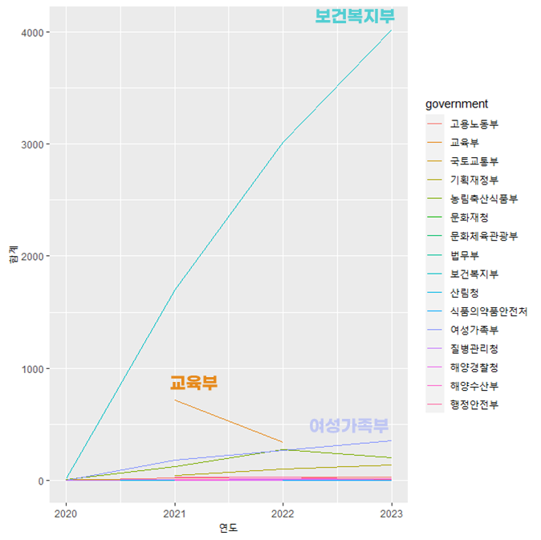
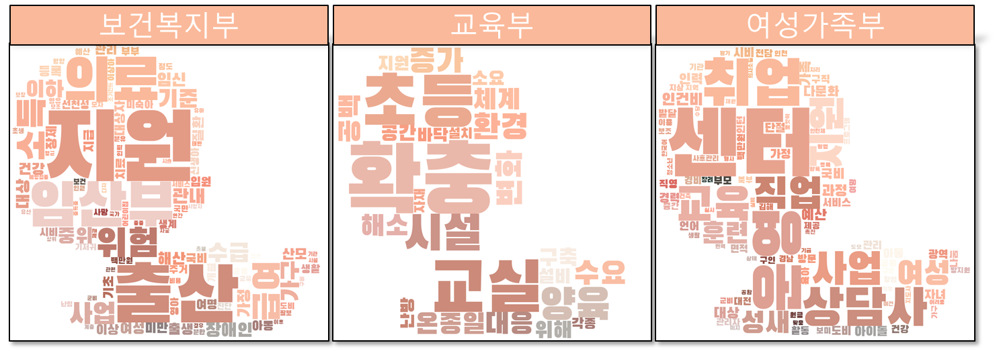
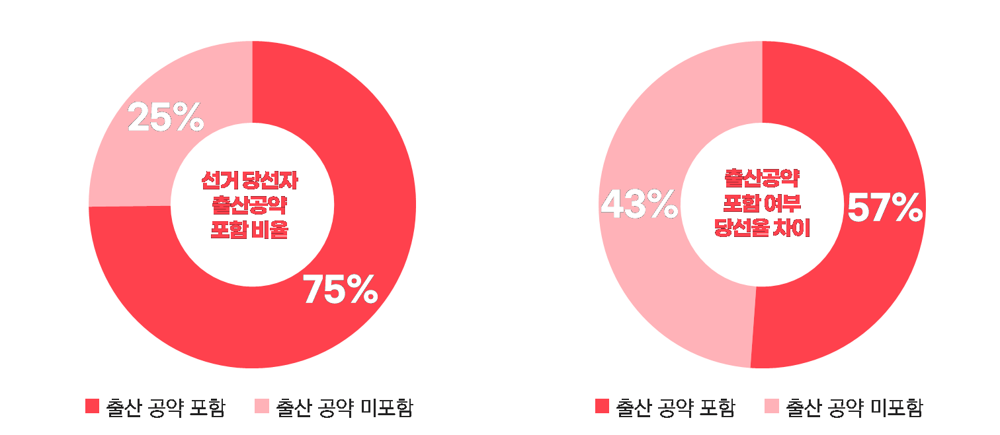
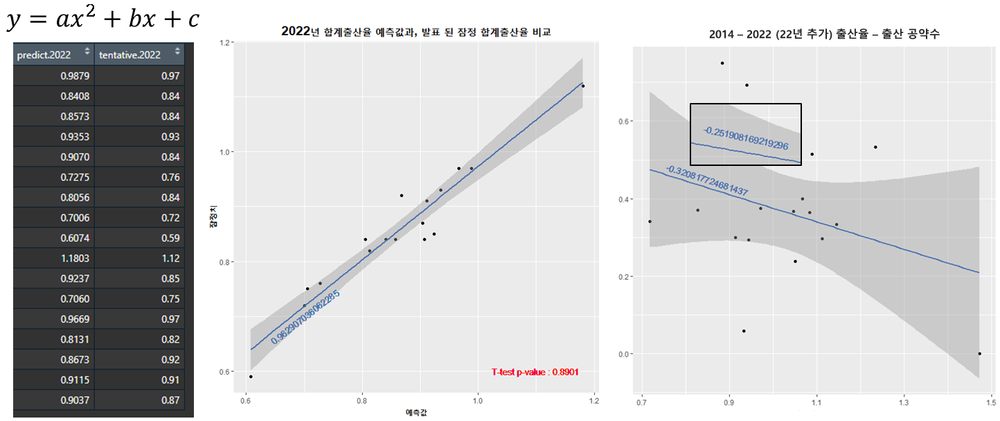
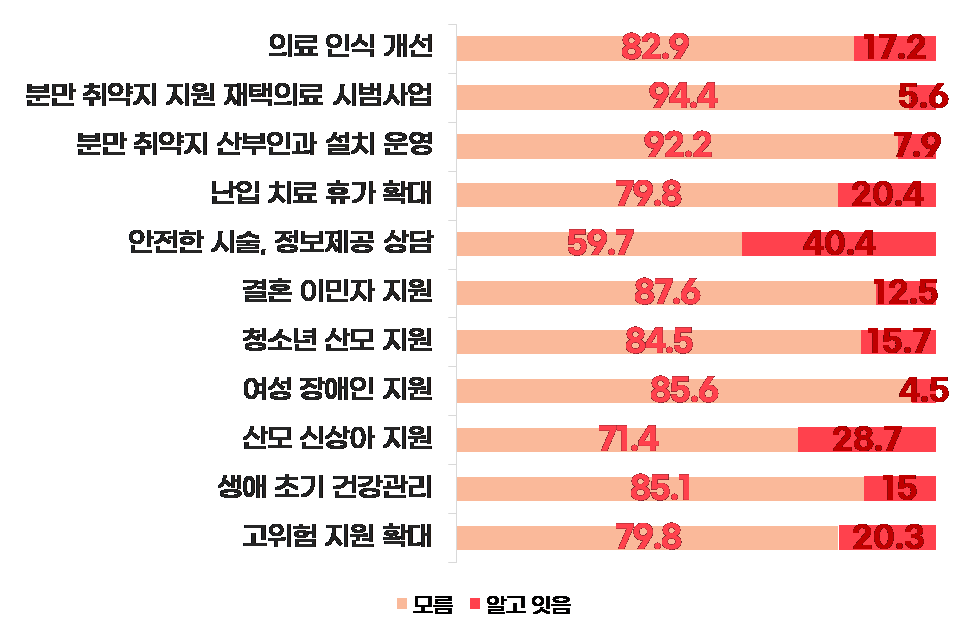
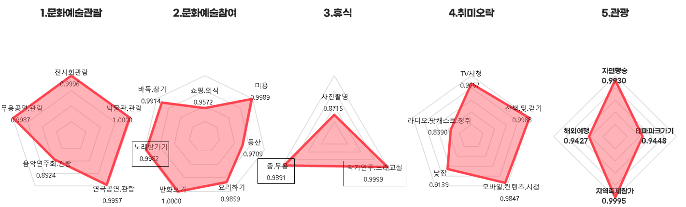
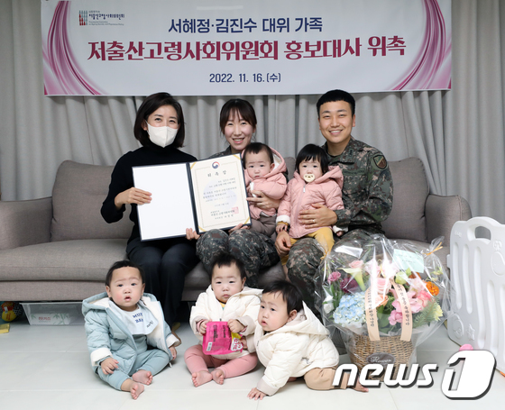
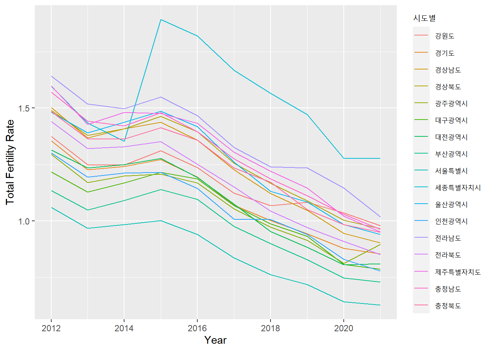

## :pushpin: Intro
>저출산 지원 정책 수립을 위한 저출산 요인 분석   

---

#### `목적`
>저출산 문제 분석 및 정부에 정책 제언 제공  

---

#### `동기`
>저출산의 사회적, 경제적 영향 해소와 출산율 증가  

---

## 1. Project Period & Role
>제작 기간: 4주(2023.04.12 ~ 2023.05.02)   

---

#### `장상윤`
>이메일: jangapp21@gmail.com 
>깃헙: https://github.com/jangsangyoon13 
>데이터 전처리 및 분석 
>프로젝트 구성 

#### `정구열`
>이메일: yeol512@nate.com 
>깃헙: https://github.com/zzang910 
>데이터 전처리 및 분석 
>프로젝트 발표 

#### `한태성`
>이메일: hantaeseong4@naver.com 
>깃헙: https://github.com/hantaeseong00/ 
>데이터셋 구축 및 시각화 
>통계 검증 
>크롤링 
>보고서 작성 

#### `황준하`
>이메일: junatrout27@gmail.com 
>깃헙: https://github.com/JunaHwang 
>팀장 
>데이터 전처리 및 시각화 
>프로젝트 발표 자료 준비 

#### `홍재연`
>이메일: yoandjung1@gmail.com 
>깃헙: https://github.com/jaexxyoyo 
>데이터 수집 및 전처리 
>종속 변수 선정 

---

## 2. Development Environment & Utilized Skils
>Python 3.9.13 
>R version 4.2.3 
>Windows 10 Pro 
>Intel(R) Core(TM) i7-9700 CPU @ 3.00GHz 
>RAM:8589934592 
>Intel(R) UHD Graphics 630 

---

#### `Utilized  Skils`
>데이터 분석 라이브러리    
	- dplyr, tidyr, tidyverse, tsibble, moonBook, car    
	- numpy, pandas, scipy.stats    
	
>웹 크롤링 라이브러리    
	- Beautiful Soup, Selenium,	Requests    
	
>시각화 
	- matplotlib, seaborn, Axes3D, WordCloud, folium    
	- ggplot2, plotly, gganimate    

>통계 및 분석 기법    
	- 기술 통계 분석     
	- 추론 통계 분석    
	- 회귀 분석    
	- 분산 분석    

---

## :pushpin: Projects
## 1. Overview
>본 프로젝트는 저출산 요인 분석을 통해 정부에 저출산 지원 정책 제안하는 것을 목표로 합니다. 
>경제적, 사회문화적 요인 등 다양한 변수를통해데이터를 분석하여 정책에 대한 실질적인 지침을 제공 합니다. 
>이를 통해 정부는 효과적인 대응 정책을 수립하고 사회적 안정성과 경제 발전을 증진시킬 수 있습니다. 

---

## 2. Expected Results
>정부에 기반된 정책 제안과 효과적인 저출산 지원 정책 수립 가능
>사회적 안정성과 경제 발전 증진
>가족 복지와 균형 재편
>장기적인 사회 변화와 지속 가능한 인구 구조 유지

---

## 3. Background

#### `출산율 감소 현황 파악`
 
_["Fertility Rate", Our World in Data, https://ourworldindata.org/fertility-rate](https://ourworldindata.org/fertility-rate)_   

>한국은 OECD 국가 중에서 출산율이 가장 낮은 수준을 보이고 있습니다. 
>이는 현재 인구 절벽 현상이 현실화되고 있는 상황에서 심각한 문제로 대두되고 있습니다. 
>출산율 저하로 인해 인구 고령화와 인구 감소로 이어지는 문제는 경제, 사회 및 정치적인 여러 측면에 영향을 미치고 있습니다. 
>이에 따라 저출산 문제의 근본적인 원인을 파악하고, 출산율을 높일 수 있는 정책과 방안을 제시하고자 합니다. 
>   
>한국의 출산율 저하에는 다양한 요인들이 작용하고 있습니다. 
>경제적인 부담, 직장과 가정 간의 균형, 주거 환경, 교육 및 복지 시스템 등이 출산 의사 결정에 영향을 미치는 주요 요인으로 알려져 있습니다. 
>이러한 요인들은 한국 사회의 구조적인 문제와 가치관 변화, 여성의 사회적 역할 변화 등과도 연관이 있을 수 있습니다. 
>   
>따라서, 출산율을 높이고 인구 절벽 문제를 해결하기 위해서는 출산율 저하의 원인을 분석하고 정책 수립에 필요한 정보를 도출해야 합니다.  
>이를 통해 정책 결정자와 이해관계자들은 저출산 문제에 대한 심층적인 이해를 갖고, 구체적이고 효과적인 정책을 마련할 수 있게 됩니다.  
>따라서, "저출산 지원 정책 수립을 위한 요인 분석"이라는 프로젝트가 중요하고 필요한 과제로 부각되고 있습니다. 

#### `출산하지 않는 이유`

 
_김은정 외 6인,『저출산ㆍ고령사회 대응 국민 인식 및 욕구 심층조사 체계 운영』, 한국보건사회연구원(2019)_  

>한국보건사회연구원이 2019년에 발표한 '저출산·고령사회 대응 국민 인식 및 욕구 심층 조사 체계 운영' 정책 현안 보고서에 따르면, 
>저출산 문제에 대한 국민 인식과 욕구를 조사한 결과, 출산을 하지 않는 가장 주된 이유로 경제적인 이유와 개인생활 및 여가활동 등으로 나타났습니다. 
>조사 대상인 19~49세 미혼 성인남녀 2000명 중 44.7%가 '경제적으로 안정되지 않아서'라고 답했습니다. 
>   
>또한, 기혼자를 대상으로 한 조사 결과도 비슷한 경향을 보였습니다. 
>기혼자들에게 '아이를 낳지 않는 이유'를 물었을 때, 37.4%가 '경제적 불안정'을 가장 큰 이유로 언급했습니다. 
>이어서 '아이 양육비 및 교육비 부담', '아이 없이 생활하는 것이 여유롭고 편하다는 이유', '아이 키울 주거환경의 부재', '아이 돌봄 시설 및 서비스의 불만족', '과도한 업무량과 바쁜 일상', '아이가 생기지 않음' 등이 나타났습니다. 
>   
>이러한 조사 결과를 통해 경제적인 불안정과 아이 양육에 따르는 경제적 부담과 여가활동에 대한 인식변화가 저출산 문제에 큰 영향을 미치고 있음을 알 수 있습니다. 
>이는 저출산 문제를 해결하기 위해 정책 수립 단계에서 경제적 측면을 고려하는 중요성을 강조하며, 출산율을 높이기 위한 정책 및 서비스의 개선이 필요하다는 시사점을 제공합니다.

---

## 4. Project Architecture
 

---

## 5. Project Result & Visualization
>
>개발 기간: 2023.06.20 ~ 2023.07.12
>  
>기술 스택:  
>Python
>  
>[1. Suggest Ambassadors for Ferility Rate](https://github.com/JunaHwang/Team1_FirstProject/tree/main/Source%20Code/1.%20Suggest%20Ambassadors%20for%20Ferility%20Rate) 참고   
>[1.1. Consumer Price Analysis](https://github.com/JunaHwang/Team1_FirstProject/tree/main/Source%20Code/1.%20Suggest%20Ambassadors%20for%20Ferility%20Rate/1.%20Consumer%20Price%20Analysis) 참고   
>[1.2. Government Policies Analysis](https://github.com/JunaHwang/Team1_FirstProject/tree/main/Source%20Code/1.%20Suggest%20Ambassadors%20for%20Ferility%20Rate/2.%20Government%20Policies%20Analysis) 참고  
>[1.3. Election Promises Analysis](https://github.com/JunaHwang/Team1_FirstProject/tree/main/Source%20Code/1.%20Suggest%20Ambassadors%20for%20Ferility%20Rate/3.%20Election%20Promises%20Analysis) 참고   
>[1.4. Leisure Lifestyle Analysis](https://github.com/JunaHwang/Team1_FirstProject/tree/main/Source%20Code/1.%20Suggest%20Ambassadors%20for%20Ferility%20Rate/4.%20Leisure%20Lifestyle%20Analysis) 참고   
>[1.5. Occupations Analysis](https://github.com/JunaHwang/Team1_FirstProject/tree/main/Source%20Code/1.%20Suggest%20Ambassadors%20for%20Ferility%20Rate/5.%20Occupations%20Analysis) 참고  
>   
>[2. Launched Loan Products for Marriage](https://github.com/JunaHwang/Team1_FirstProject/tree/main/Source%20Code/2.%20Launched%20Loan%20Products%20for%20Marriage) 참고   
>[2.1. Assets Liabilities Analysis](https://github.com/JunaHwang/Team1_FirstProject/tree/main/Source%20Code/2.%20Launched%20Loan%20Products%20for%20Marriage/1.%20Assets%20Liabilities%20Analysis) 참고   
>[2.2. Married Unmarried Status Analysis](https://github.com/JunaHwang/Team1_FirstProject/tree/main/Source%20Code/2.%20Launched%20Loan%20Products%20for%20Marriage/2.%20Married%20Unmarried%20Status%20Analysis) 참고   
>[2.3. Quarterly Analysis](https://github.com/JunaHwang/Team1_FirstProject/tree/main/Source%20Code/2.%20Launched%20Loan%20Products%20for%20Marriage/3.%20Quarterly%20Analysis) 참고  

---

### [5.1. Suggest Ambassadors for Ferility Rate](https://github.com/JunaHwang/Team1_FirstProject/tree/main/Source%20Code/1.%20Suggest%20Ambassadors%20for%20Ferility%20Rate)

#### `Consumer Price Analysis`
 

>**합계출산율의 증감과 소비자물가의 증감 간의 상관분석을 진행**하였습니다. 
>소비자물가 항목 중 유아용품 및 육아시설에 대한 상관분석을 수행하고, 후진제거법을 통해 Feature를 줄였습니다. 

| 항목 | 상품명 | Estimate | Std. Error | t value | Pr(>&#124;t&#124;) |
| :-- | :-- | :-- | :-- | :-- | :-- |
| 유아용품 | 분유 | 0.0012776  | 0.0002095  | 6.098 | 1.86e-09 &#42;&#42;&#42; |
|  | 유아동복 | -0.0039445 | 0.0004253 | -9.274 | < 2e-16 &#42;&#42;&#42; |
|  | 아동화 | -0.0055641 | 0.0005216 | -10.668 | < 2e-16 &#42;&#42;&#42; |
|  | 유모차 | 0.0010439 | 0.0002347 | 4.448 | 1.02e-05 &#42;&#42;&#42; |
| | | | | | |
| 육아시설 | 유치원납입금 | 5.495e-04 | 6.786e-05 | 8.097 | 2.81e-15 &#42;&#42;&#42; |
| | 보육시설이용료 | 2.911e-04 | 8.022e-05 | 3.628 | 0.000308 |
| | 산후조리원이용료 | -3.409e-03 | 2.385e-04 | -14.290 | < 2e-16 |

>분석 결과를 요약한 결과도표를 통해 다음과 같은 정보를 얻을 수 있었습니다 
   
>유아용품 
	- 분유, 유아동복, 아동화, 유모차가 출산율과의 상관관계를 가지며, 유아용품 가격 변동은 출산율에 영향을 줄 수 있음을 시사합니다. 
	- 분유와 유모차의 경우, 갓난아이가 사용 할 것으로 보이는 상품입니다. 
	- 유아동복, 아동화, 장난감의 경우, 갓난아이가 사용 하지 않을 것으로 보이는 상품입니다. 
	- 따라서, **아이의 출산연도가 멀어질수록 유아용품과 합계출산율의 관계는 양의 관계에서 음의 관계로 변함**을 시사합니다. 
   
>육아시설 
	- 유치원 납입금과 보육시설 이용료는 출산율과 상관관계가 있으며, 이러한 육아시설의 비용 요소는 출산 결정에 영향을 미칠 수 있음을 나타냅니다. 
	- 산후조리원이용료는 출산 직후 사용될 시설 비용으로 판단됩니다. 
	- 유치원납입금, 보육시설이용료는 아이가 어느정도 자란 뒤 사용할 것으로 보이는 비용으로 판단됩니다. 
	- 따라서, **아이의 출산연도가 멀어질수록 육아시설과 합계출산율의 관계는 음의 관계에서 양의 관계로 변함**을 시사합니다 
   
>사교육비 
	- 다중공선성 위반 
	
| 유아용학습교재 | 중학교학습서 | 고등학교학습서 | 초등학생학원비 | 중학생학원비 | 고등학생학원비 |
| :-- | :-: | :-: | :-: | :-: | :-: |
| 2.682142 | 2.509470 | 2.061493 | 2.839550 | 2.954345 | 2.548375 |

> 사교육비 분석 결과 **다중공선성을 위반하여 상호간의 관계를 파악할 수 없었으며, 교육비 요소들 간에 상관관계가 있는 것으로 확인**되었습니다. 
> 이를 통해, 정부정책 분석을 통해 도출 된 저출산에 대한 **교육부의 높은 관심도가 설명**이 되었습니다. 

---

#### `Government Policies Analysis`

<!-- -->

>**합계출산율과 정부 정책의 수 간의 상관분석을 진행**하였습니다. 
>우선, 정부 정책에서 '출산' 단어가 포함된 정책의 수를 파악하였습니다.  
>결과적으로 보건복지부의 정책이 4000여 건으로 가장 많았으며, 교육부, 여성가족부, 농림축산식품부 순으로 나타났습니다. 
>처음 예상과는 달리, **보건복지부가 출산에 대해 가장 큰 관심**을 보이고 있었습니다. 
>또한, **교육부의 관심은 Consumer Price Analysis에서의 사교육비 항목에서 도출된 내용과 일치하여 높은 관심도를 설명**할 수 있었습니다. 
  
 

>또한, 각 해당 정책들의 내용을 형태소 분석을 통해 살펴보았습니다. 
>보건복지부의 정책에서는 지원, 출산, 의료, 임산부, 위험 등의 키워드가 높은 빈도로 등장했으며, 
>교육부의 정책에서는 확충, 초등, 교실, 시설, 양육 등이 주요 키워드로 나타났습니다.  
>여성가족부의 정책에서는 센터, 운영, 교육, 취업, 상담사 등의 키워드가 빈도가 높게 나타났습니다. 
  
>이러한 결과를 통해 각 부처의 관심사와 정책 내용을 파악할 수 있었습니다. 
>**보건복지부는 출산에 대한 지원과 의료 서비스**에 집중하고 있으며, 
>**교육부는 사교육 시설의 확충 및 양육과 교육**에 대한 관심을 보이고 있습니다. 
>**여성가족부는 여성과 가족의 삶 전반에 대한 지원과 교육, 취업, 상담** 등에 초점을 맞추고 있음을 알 수 있습니다. 
   
---

#### `Election Promises Analysis`

 
   
>**선거 당성자의 출산공약 비중과 합계출산율 간의 상관분석을 짆애**하였습니다. 
>2017년부터 2022년까지의 선거 당성자들의 출산공약 포함 비율은 약 75%였으며, 이 중 출산공약을 포함한 당선자들의 비율은 57%였습니다. 
>이는 출산공약의 비중은 높지만, **출산 공약이 선거 당선 여부에는 크게 영향을 끼치지 못함**을 시사합니다. 
   
 
   
>또한, 출산공약 비중의 경향성을 평가하기 위해 **2022년 합계출산율을 추정**하였습니다. 
>2014년부터 2021년까지의 합계출산율과 출산공약 비중 사이에는 약 -0.25의 음의 상관관계가 있었으며, 
>2014년부터 **2022**년까지의 합계출산율과 출산공약 비중 사이에는 -0.32로 **더 강한 음의 상관관계**가 나타났습니다. 
   
>분석 결과, 선거 당선자들의 **출산공약 비중은 합계출산율이 낮아짐에 따라 민감하게 반응하는 경향**을 보이는 것으로 판단됩니다. 
>출산율이 낮아질수록 선거 당선자들은 출산 관련 공약을 더욱 중요하게 여기고 이를 선거 공약에 포함시키는 경향이 있습니다.  
이는 선거를 통해 정부에 선출된 당선자들이 출산 문제에 대한 인식을 가지고 있으며, 출산율 증진을 위한 정책과 지원을 약속하고자 하는 것으로 해석됩니다. 
   
---
   
#### `1st Conclusion`
   
>Government Policies Analysis과 Election Promises Analysis의 분석 결과,  
>**정부는 출산 문제에 대해 민감하게 대응**하고 있는 것으로 나타났습니다.  
>그러나 **출산율은 여전히 감소하는 추세**를 보이고 있습니다.  
>이로 인해 사람들이 정부의 **정책에 대한 인지도와 관심도를 확인**해 볼 필요성이 있음을 알 수 있었습니다. 

 
   
>분석에서 확인된 정책 인지도 평가 결과를 살펴보면, 
>대다수의 정부 **정책에 대한 사람들의 인지도가 낮음**을 알 수 있습니다. 
>정부가 제공하는 출산 관련 정책들에 대한 인지도가 높은 정도는 20%에서 40% 사이로 제한적인 것으로 나타났습니다. 
>이는 **정부의 노력과 대응에도 불구하고, 대중들이 출산 관련 정책에 대한 관심이 낮다**는 것을 시사합니다. 
   
>**따라서, 정부 정책을 효과적으로 홍보하고 대중들의 인지도와 관심을 높이는 방안을 마련하는 것이 더욱 중요하다고 판단됩니다.**  
   
---
   
#### `Leisure Lifestyle Analysis`

>**합계출산율의 증감과 여가생활의 증감 간의 상관분석**을 진행하였습니다. 
>여가생활 항목 중 문화예술관람활동, 문화예술참여활동, 관광활동, 취미오락활동, 휴식활동에 대한 상관분석을 수행하였고 
>후진제거법을 통해 Feature를 줄였습니다. 
   
| 항목 | 여가활동명 | Estimate | Std. Error | t value | Pr(>&#124;t&#124;) |
| :-- | :-- | :-- | :-- | :-- | :-- |
| 여가활동 | 문화예술참여활동 | 0.009366 | 0.002887    | 3.244  | 0.001620 &#42;&#42; |
|  | 문화예술참여활동 | 0.021582    | 0.013136    | 1.643  | < 0.103663  |
|  | 관광활동 | -0.009843 | 0.004139 | -2.378 | < 0.019390 &#42; |
|  | 취미오락활동 | -0.013210 | 0.003463 | -3.815  | 0.000241  &#42;&#42;&#42; |
|  | 휴식활동 | 0.008276 |  0.003035  | 2.726 | 0.007612 | &#42;&#42; |
   
>분석결과, 양의 관계를 보이는 **문화예술참여활동과 휴식활동은 기혼자와 관계**가 있을 것으로 추정된다. 
>음의 관계를 보이는 **관광활동과 취미오락활동은 미혼자와 관계**가 있을 것으로 추정된다. 
   
>이에 따라, 각각의 여가활동별 혼인상태(기혼, 미혼, 이혼)에 따른 차이검정을 실시하였습니다. 
>결과적으로 문화예술참여활동은 혼인상태별 차이가 없었습니다. 
>관광활동은 출산을 할 것으로 기대되는 군집(기혼)과 출산을 하지 않을 것으로 기대되는 군집(미혼, 이혼) 간에 차이가 있었습니다. 
>취미오락활동은 혼인상태별로 차이가 있었지만, 이는 혼인상태보다는 나이에 따른 결과로 추측됩니다. 
>여가활동은 출산을 했을 것으로 기대되는 군집(기혼, 이혼)과 출산을 하지 않았을 것으로 기대되는 군집(미혼) 간에 차이가 있었습니다. 
   
>분석 결과를 통해 **여가활동과 출산율 사이에 일부 관련성이 확인되었으며, 혼인상태와 나이도 여가활동과 관련된 요소**임을 알 수 있습니다. 
>이를 통해 출산율을 높이기 위해 정책을 수립할 때 혼인 상태, 연령대 및 여가활동의 차이를 고려해야 함을 시사합니다. 
   
>추가적으로 **합계출산율의 증감과 각각의 여가활동별 세부 항목에 대한 상관분석을 진행**하였습니다. 
>후진제거법을 통해 Feature를 줄였고, 결과는 다음 그림과 같습니다. 

 
   
>분석 결과, 노래교실, 춤(무용), 노래방 가기 등의 여가활동 항목은 합계출산율과 높은 관계성을 보였습니다. 
>이러한 결과를 통해 **가수, 댄서 등 연예나 K-산업과 출산율이 관련이 있을 것으로 추측**됩니다. 
>여가활동을 통해 문화 예술적인 활동에 참여하거나 음악과 춤과 관련된 활동을 즐기는 사람들은 출산에 대한 긍정적인 태도를 가질 수 있을 것으로 생각됩니다. 
   
>이와 함께, 분석 결과를 바탕으로 **합계출산율과 직업군 간의 관계를 분석할 필요성도 도출**되었습니다. 
>여가활동과 관련된 직업군이 출산율에 영향을 미칠 수 있으며, 특정 직업군과 출산율 간의 연관성을 파악하는 것이 중요합니다. 
>예를 들어, 연예인, 예술가, 음악가와 같은 직업군이 출산에 대한 선택과 관련이 있을 수 있으며, 
>이를 통해 출산율을 영향할 수 있는 요인을 파악할 수 있을 것으로 기대됩니다. 

#### `Occupations Analysis`

>앞서 Leisure Lifestyle Analysis 결과를 기반으로, **직업군과 출산율 간의 상관관계를 조사**하였습니다. 
>저희는 음악관련인, 미술관련인, 무대관련인으로 직업군을 분류하였습니다.  
>분류 된 직업군을 기준으로 후진제거법을 통해 Feature를 줄였습니다. 
   
| 직업군 | 직업명 | Estimate | Pr(>&#124;t&#124;) |
| :-- | :-- | :-- | :-- |
| 음악관련인 | 가수 | -0.14061 | 0.072797 |
|  | 연주가.국악 | 0.24851 | 0.059589 |
|  | 안무가 | -1.10422 | 0.004987 &#42; |
|  |  |  |  |
| 미술관련인 | 디자이너 | -0.7328 | 0.013761  &#42; |
|  | 성우 | -1.1141 | 0.003771 &#42;&#42; |
|  | 애니메이터 | 0.8248 | 0.178417 |
|  | 만화가.웹툰작가 | 0.7768 | 0.009364 &#42;&#42; |
|  |  |  |  |
| 무대관련인 | 모델 | -7.9138 | 0.00154 &#42;&#42; |
   
>분석 결과, 예상과는 달리 음악관련인 중 가수는 출산율과 상관관계가 없는 것으로 나타났습니다. 
>반면, **안무가는 출산율과 음의 상관관계**를 보였습니다. 
>이는 안무가로서의 직업을 가진 사람들이 출산에 대한 결정을 미루거나 출산을 보다 어려워하는 경향이 있을 수 있음을 시사합니다. 
   
>미술관련인 중 **디자이너와 성우는 출산율과 음의 상관관계**를 보였습니다. 
>디자이너와 성우로서의 직업을 가진 사람들은 출산에 대한 결정을 미루거나 출산을 어려워하는 경향이 있을 수 있습니다. 
>반면, **애니메이터와 만화가.웹툰작가는 출산율과 양의 상관관계**를 보였으며, 이는 해당 직업을 가진 사람들이 출산을 고려하는 경향이 있을 수 있음을 시사합니다. 
   
>무대관련인 중 **모델은 출산율과 음의 상관관계**를 보였습니다.  
>모델로서의 직업을 가진 사람들은 출산에 대한 결정을 미루거나 출산을 어려워하는 경향이 있을 수 있습니다. 
   
>이러한 분석 결과는 특정 직업군이 출산 결정에 영향을 미칠 수 있음을 시사합니다.  
>음악관련인, 미술관련인, 무대관련인 직업을 가진 사람들은 출산에 대한 고려를 더욱 신중하게 할 가능성이 있으며,  
>이를 고려하여 정부와 관련 기관은 해당 직업군에 대한 출산 지원 정책을 마련할 수 있습니다.  
>또한, **안무가, 만화가, 웹툰작가 등 특정 직업군에 대한 출산 결정에 영향을 미치는 요인을 파악**하여 이에 맞는 정책을 수립할 필요가 있습니다. 
   
---
   
#### `Final Conclusion: **Suggest Ambassadors for Ferility Rate**`

>Leisure Lifestyle Analysis과 Occupations Analysis의 분석 결과,  
>**춤, 무용, 만화, 웹툰 분야에서 출산율과 여가활동 및 직업군 간에 상관관계**가 나타났습니다. 
>이는 해당 분야의 직업군이 출산율과 밀접한 관련이 있음을 시사합니다.  
   
 
_["다섯쌍둥이 저출산고령사회위원회 홍보대사 위촉", news1, https://www.news1.kr/photos/view/?5687905&view=pc](https://www.news1.kr/photos/view/?5687905&view=pc)_   
   
>이를 바탕으로 저희는 **저출산 홍보대사로 유명 웹툰 작가 또는 안무가를 제안**합니다. 
   
>유명 웹툰 작가는 많은 사람들에게 인기있는 콘텐츠를 제공하며, 그들의 작품은 젊은 세대를 중심으로 큰 인기를 끌고 있습니다. 
>웹툰 플랫폼을 통해 출산에 대한 정보와 정책을 전달하면 많은 사람들에게 도달할 수 있으며, 젊은 세대를 중심으로 출산에 대한 긍정적인 인식을 조성할 수 있습니다. 
   
>또한, 안무가는 춤과 무용을 통해 예술적인 표현을 제공하며, 무용공연은 많은 관객들이 참여하고 즐기는 문화 활동입니다. 
>춤과 무용을 통해 출산에 대한 메시지와 정책을 전달하면 관객들에게 출산에 대한 긍정적인 인식을 심어줄 수 있습니다. 
>무용공연 관람 시설을 통해 출산정책을 홍보하면 더욱 효과적으로 정책 홍보 효과가 기대될 것입니다. 
   
>따라서, 저희는 **유명 웹툰 작가 또는 안무가를 저출산 홍보대사로 제안**하고,  
>**웹툰 플랫폼과 무용공연 관람 시설을 통해 출산정책을 홍보**하는 것이 저출산 대응 정책의 성공에 도움이 될 것으로 판단합니다. 
>이를 통해 출산율을 높이고, 사회적으로 지속 가능한 출산 문화를 조성할 수 있을 것으로 기대됩니다. 
   
---

### [5.2. Launched Loan Products for Marriage](https://github.com/JunaHwang/Team1_FirstProject/tree/main/Source%20Code/2.%20Launched%20Loan%20Products%20for%20Marriage)

#### `Assets Liabilities Analysis`

>**합계출산율의 증감과 자산 부채 소득 증감 간의 상관분석**을 진행하였습니다. 
>저희는 **몇년전의 자산변화가 출산율의 영향을 미치는지에 대해서 분석을 실시**하였습니다. 
>경상소득, 자산, 부채, 순자산액으로 구분지어 분석을 실시했습니다. 
   
| 항목 | 시기 | Estimate | Std. Error | t value | Pr(>&#124;t&#124;) |
| :-- | :-- | :-- | :-- | :-- | :-- |
| 경상소득 | 현재 | -0.09963 | 0.17202 | -0.579 | 0.5643 |
|  | 1년전 | -0.26805 | 0.22132 | -1.211 | 0.2297 |
|  | 2년전 | -0.29537 | 0.21201 | -1.393 | 0.1678 |
|  | 3년전 | 0.0262 | 0.20946 | 0.125 | 0.9008 |
|  | 4년전 | -0.13123 | 0.20479 | -0.641 | 0.5237 |
|  | 5년전 | -0.45309 | 0.20426 | -2.218 | 0.0297 &#42; |
|  |  |  |  |  |  |
| 자산 | 현재 | -0.13351 | 0.09894 | -1.349 | 0.18138 |
|  | 1년전 | -0.05306 | 0.11111 | -0.478 | 0.63442 |
|  | 2년전 | 0.28232 | 0.10091 | 2.798 | 0.00657 &#42;&#42; |
|  | 3년전 | 0.09525 | 0.09698 | 0.982 | 0.32927 |
|  | 4년전 | -0.20882 | 0.08321 | -2.509 | 0.01431 &#42; |
|  | 5년전 | -0.45103 | 0.08339 | -5.409 | 7.67E-07 &#42;&#42; |
|  |  |  |  |  |  |
| 부채 | 현재 | -0.11258 | 0.07485 | -1.504 | 0.13684 |
|  | 1년전 | 0.07116 | 0.07872 | 0.904 | 0.36894 |
|  | 2년전 | 0.24307 | 0.07573 | 3.209 | 0.00198 &#42;&#42; |
|  | 3년전 | -0.01642 | 0.0758 | -0.217 | 0.82907 |
|  | 4년전 | -0.02124 | 0.07817 | -0.272 | 0.78658 |
|  | 5년전 | -0.06268 | 0.08278 | -0.757 | 0.45137 |
|  |  |  |  |  |  |
| 순자산액 | 현재 | -0.08657 | 0.08848 | -0.978 | 0.3311 |
|  | 1년전 | -0.04868 | 0.10167 | -0.479 | 0.6335 |
|  | 2년전 | 0.20877 | 0.09616 | 2.171 | 0.0332 &#42; |
|  | 3년전 | 0.11648 | 0.09158 | 1.272 | 0.2074 |
|  | 4년전 | -0.18359 | 0.07579 | -2.423 | 0.0179 &#42; |
|  | 5년전 | -0.41804 | 0.07639 | -5.472 | 5.95E-07 &#42;&#42;&#42; |
   
>경상소득의 경우 현재 및 1년 전, 2년 전, 4년 전의 경상소득과 합계출산율 간에는 유의미한 상관관계가 나타나지 않았습니다. 
>다만, 5년 전의 경상소득과 합계출산율 간에는 음의 상관관계가 나타났습니다. 
   
>자산의 경우 현재 및 1년 전, 3년 전, 4년 전의 자산과 합계출산율 간에는 유의미한 상관관계가 나타나지 않았습니다.  
>하지만 2년 전 및 5년 전의 자산과 합계출산율 간에는 양의 상관관계가 나타났습니다. 
   
>부채의 경우 현재 및 1년 전, 3년 전, 4년 전의 부채와 합계출산율 간에는 유의미한 상관관계가 나타나지 않았습니다.  
>다만, 2년 전의 부채와 합계출산율 간에는 양의 상관관계가 나타났습니다. 
   
>순자산액의 경우 현재 및 1년 전, 3년 전의 순자산액과 합계출산율 간에는 유의미한 상관관계가 나타나지 않았습니다.  
>하지만 2년 전 및 4년 전, 5년 전의 순자산액과 합계출산율 간에는 음의 상관관계가 나타났습니다. 

>이를 종합해보면, 경상소득과 합계출산율 간에는 유의미한 상관관계가 나타나지 않았으며,  
>자산과 합계출산율 간에는 양의 상관관계, 부채와 합계출산율 간에는 양의 상관관계, 순자산액과 합계출산율 간에는 음의 상관관계가 나타났습니다. 
>특히 **2년전의 자산과 부채가 양의 상관관계**를 나타났으며, **5년전의 자산, 부채, 순자산액이 음의 상관관계**를 나타났습니다. 
  
>2년 전의 자산과 부채가 양의 상관관계를 나타낸 것으로 보아, 부채의 증가가 자산의 증가와 관련이 있을 수 있다고 판단됩니다.  
>이는 부채를 통해 자산을 확보하려는 경향이 출산율에 긍정적인 영향을 미칠 수 있음을 시사합니다.  
>출산하기 2년전의 가계의 경제적인 안정성을 향상시키고 자산을 확보할 수 있는 조건이 출산을 고려하는 가구들에게 도움을 줄 수 있는 것으로 판단됩니다. 
   
 
   
>또한, 5년 전의 자산, 부채, 순자산액이 음의 상관관계를 나타내는 이유는 합계출산율의 변화를 살펴보면 알 수 있습니다.  
>분석에 사용된 데이터에서 5년 전은 2016년이며, 이후 합계출산율은 꾸준히 감소하고 있는 것을 확인할 수 있습니다.  
>이러한 추세로 인해 자산, 부채, 순자산액의 변동이 합계출산율에 음의 영향을 미치는 것으로 해석됩니다. 
   
>따라서, 2년 후의 출산율 상승을 위해 부채 대응 정책이 필요하다는 결론을 내릴 수 있습니다. 
>이에 정부와 관련 기관이 2년 전에 가계의 경제적 안정성을 향상시키고 부채 부담을 경감시키는 노력을 진행해야 합니다. 
>이러한 정부의 대응이 출산에 대한 부담을 덜어주고 가구들이 경제적인 안정을 더 잘 확보할 수 있도록 도움을 줄 것으로 기대됩니다. 

---

#### `Married Unmarried Status Analysis`
   
>**합계출산율과 혼인여부에 따른 상관분석**을 진행하였습니다. 
>**현재의 부채수준이 5년후의 미래의 혼인상태에 영향을 미치는지에 대해서 분석을 실시**하였습니다. 
   
 
   
>분석 결과에 따르면, **부채액의 상승이 5년 후의 미혼율 증가와 관련이 있는 것**으로 확인되었습니다.  
>특히 연령대가 높아질수록 부채액이 미혼율에 미치는 영향력이 더 강하게 나타났으며,  
>연령대가 어려질수록 부채액의 증가에 따른 미혼율의 증가가 가파르게 나타났습니다.  
>이는 부채액의 증가가 혼인 여부에 영향을 주는 요인 중 하나임을 시사합니다. 

>따라서, 가계의 경제적 안정성을 향상시키고 부채 부담을 경감시키는 정책을 통해 미혼율의 상승을 억제할 수 있습니다.  
>특히 젊은 연령대에서의 부채 문제에 대한 대책 마련이 중요하며, 자금 지원, 재무 교육, 부채 조절 방안 등이 고려될 수 있습니다.  
>이를 통해 혼인 여부에 따른 출산 결정에 영향을 미치는 요소 중 하나인 부채 문제를 해소하고, 출산율 상승을 도모할 수 있을 것입니다. 

---

#### `Quarterly Analysis`
   
>**분기별 합계출산율의 분석**을 진행하였습니다. 
>앞선 분석과정을 통해 출산정책을 적용하기 위한 시기에 대해서 판별하였습니다. 
>이에 저희는 연도별 분석에서 끝내지 않고 분기별 분석을 통해 1년 중 어느 분기에 합계출산율이 가장 높고 낮은지를 파악하였습니다. 
   
 
   
>분석 결과를 통해 분기별 합계출산율의 변화를 파악하였습니다.  
>그 중에서도 1분기에 합계출산율이 가장 높았으며, 2분기와 3분기는 큰 차이가 없었고, 4분기에 합계출산율이 가장 낮았습니다.  
>이를 통해 사람들이 **1분기에서 2분기 사이에 출산 계획을 세운다는 경향**이 나타났습니다. 
   
>따라서, **출산장려를 위한 정부 정책을 효과적으로 적용하기 위해서는 1분기에서 2분기 사이에 해당 정책을 제시하는 것이 중요**합니다. 
>이 시기에 출산에 대한 관심과 준비가 높아지므로, 정부의 출산정책을 적절히 홍보하고 지원하는 것이 출산율 증진에 도움이 될 것입니다.  
>또한, 분기별 출산율 변화를 고려하여 출산정책의 세부적인 시기와 방향성을 조정하는 것이 필요할 것입니다. 
   
---
   
#### `Final Conclusion: **Launched Loan Products for Marriage**`
   
>Launched Loan Products for Marriage 의 분석 결과를 종합해 보면, **출산장려를 위한 대출상품을 제시하는 적절한 시기를 도출**할 수 있었습니다. 
>저출산은 혼인시기의 늦어짐과 밀접한 관련이 있으며, 어린 나이일 수록 저렴한 대출 상품을 통해 미혼율을 감소시킬 수 있다는 것을 확인했습니다. 
>또한, 2년 전의 대출 증가가 출산율과 긍정적인 상관관계를 가지는 것을 알았으며, 이로부터 출산을 계획하고 준비하는 시기를 추측할 수 있었습니다. 
>분기별 출산율 분석에서는 1분기에서 2분기 사이에 출산계획이 세워지는 경향을 발견했습니다. 

>따라서, 우리는 **2년 후의 출산을 고려하는 혼인 및 출산 장려 1분기 대출상품을 제시**합니다. 
>이미 다양한 출산 장려 대출상품이 존재하지만, 우리의 분석은 **정확한 시기를 제시**해주었습니다. 
>이를 통해 더욱 효과적인 저출산 대책을 수립할 수 있고, 정부 및 관련 기관은 해당 대출상품을 개발하여 저출산 문제를 해결할 수 있을 것으로 기대됩니다. 

---

## 6. Limitations and Compensation Points

#### `데이터의 시간 단위`
>수집한 데이터의 대부분이 연도별 데이터가 아닌 5년단위, 3년단위 등 긴 텀을 가지고 있어서 데이터 간의 공통된 연도수가 부족하였습니다.
>이로 인해 분석에 어려움을 겪었습니다.
>따라서 보다 정확하고 신뢰할 수 있는 데이터 수집을 위해 더 많은 노력이 필요합니다.
   
#### `데이터의 시점`
>대부분의 데이터가 2021년 이전의 자료로 구성되어 있어서 현재 상황을 완전히 반영하지 못했습니다.
>특히, 최근 2-3년 동안의 데이터에는 코로나로 인한 영향으로 인해 정확한 분석이 되지 않았을 가능성이 있습니다.
>따라서 코로나로 인한 출산율 변화에 대한 분석이 추가적으로 필요합니다.
   
#### `분기별 합계출산율 데이터의 부재`
>분기별 합계출산율 데이터를 별도로 제공받지 못했기 때문에, 이를 계산하기 위해 별도의 과정을 거쳤습니다.
>서울시의 데이터를 활용하여 각 지역의 분기별 합계출산율을 추정하였습니다.
>분기별 출산율 데이터의 수집과 분석은 출산율 변화를 보다 정확하게 이해하는 데 중요한 역할을 할 수 있습니다.
   
#### `선거공약 데이터의 제한`
>선거공약 데이터의 경우 일부 선거 데이터가 제공되지 않았거나, 당선자들의 데이터만 존재하는 경우가 있었습니다.
>이로 인해 선거공약에 대한 전체적인 분석이 제한되었습니다.
>선거 공약 데이터의 완전성과 다양성을 높이기 위한 노력이 필요합니다.
   	
#### `Conclusion`
>프로젝트 진행 과정에서 어려움을 겪었지만, 이를 통해 성장할 수 있었습니다. 
>계속해서 발전하고 더 나은 결과물을 제공하기 위해 노력할 것입니다. 
>한계점을 인식하고 향후 과제에 대한 계획을 세움으로써, 우리는 더 나은 프로젝트를 구현하고자 합니다. 
	
---

## 7. Reference
>[통계청,「인구동향조사」, 2021, 2023.04.27, 시도/합계출산율, 모의 연령별 출산율](https://kosis.kr/statHtml/statHtml.do?orgId=101&tblId=DT_1B81A21&conn_path=I2) 
>[통계청, 한국은행, 금융감독원,「가계금융복지조사」, 2017, 2023.04.28, 가구주연령계층별(10세) 자산, 부채, 소득 현황  ](https://kosis.kr/statHtml/statHtml.do?orgId=101&tblId=DT_1J20112&conn_path=I2) 
>[통계청,「지역소득」, 2021, 2023.04.26, 시도별 1인당 지역내총생산, 지역총소득, 개인소득]( https://kosis.kr/statHtml/statHtml.do?orgId=101&tblId=DT_1C86&conn_path=I2)
>[통계청,「인구동향조사」, 2021, 2023.04.26, 시도/합계출산율, 모의 연령별 출산율](https://kosis.kr/statHtml/statHtml.do?orgId=101&tblId=DT_1B81A21&conn_path=I2)
>[통계청, Statistics Korea.「인구동향조사」](https://www.index.go.kr/unify/idx-info.do?idxCd=5061) 
>[통계청,「인구동향조사」, 2022, 2023.04.28, 시도/시군구별 평균초혼 연령](https://kosis.kr/statHtml/statHtml.do?orgId=101&tblId=DT_1B83A09&conn_path=I2) 
>[통계청,「인구동향조사」, 2021, 2023.04.28, 시군구/합계출산율, 모의 연령별 출산율](https://kosis.kr/statHtml/statHtml.do?orgId=101&tblId=DT_1B81A17&conn_path=I2) 
>[문화체육관광부,「국민여가활동조사」, 2021, 2023.04.27, 지난 1년 동안 가장 많이 참여한 여가활동 (1+2+3+4+5순위)_중분류]( https://kosis.kr/statHtml/statHtml.do?orgId=113&tblId=DT_113_STBL_1026897&conn_path=I2) 
>[문화체육관광부,「국민여가활동조사」, 2021, 2023.04.27, 지속적으로 반복적 참여 여가활동 분야 및 활동_문화예술 관람활동]  ( https://kosis.kr/statHtml/statHtml.do?orgId=113&tblId=DT_113_STBL_1028387&conn_path=I2  ) 
>[문화체육관광부,「국민여가활동조사」, 2021, 2023.04.27, 지속적으로 참여하는 여가활동 분야 및 활동_문화예술 참여활동]  ( https://kosis.kr/statHtml/statHtml.do?orgId=113&tblId=DT_113_STBL_1028388&conn_path=I2  ) 
>[문화체육관광부,「국민여가활동조사」, 2021, 2023.04.27, 지속적으로 참여하는 여가활동 분야 및 활동_스포츠 관람활동]  (https://kosis.kr/statHtml/statHtml.do?orgId=113&tblId=DT_113_STBL_1028389&conn_path=I2  ) 
>[문화체육관광부,「국민여가활동조사」, 2021, 2023.04.27, 지속적으로 참여하는 여가활동 분야 및 활동_스포츠 참여활동]  ( https://kosis.kr/statHtml/statHtml.do?orgId=113&tblId=DT_113_STBL_1028392&conn_path=I2 ) 
>[문화체육관광부,「국민여가활동조사」, 2021, 2023.04.27, 지속적으로 참여하는 여가활동 분야 및 활동_관광 활동]  (https://kosis.kr/statHtml/statHtml.do?orgId=113&tblId=DT_113_STBL_1028393&conn_path=I2  ) 
>[문화체육관광부,「국민여가활동조사」, 2021, 2023.04.27, 지속적으로 참여하는 여가활동 분야 및 활동_취미・오락 활동]  ( https://kosis.kr/statHtml/statHtml.do?orgId=113&tblId=DT_113_STBL_1028395&conn_path=I2 ) 
>[문화체육관광부,「국민여가활동조사」, 2021, 2023.04.27, 지속적으로 참여하는 여가활동 분야 및 활동_사회 및 기타 활동]  (https://kosis.kr/statHtml/statHtml.do?orgId=113&tblId=DT_113_STBL_1028396&conn_path=I2  ) 
>[문화체육관광부,「예술인실태조사」, 2021, 2023.04.27, 현재 예술분야에서 종사하는 주 활동]  (https://kosis.kr/statHtml/statHtml.do?orgId=113&tblId=DT_113_STBL_1028104&conn_path=I2  ) 
>[문화체육관광부,「국민여가활동조사」, 2021, 2023.04.27, 여가활동의 주된 목적]  (https://kosis.kr/statHtml/statHtml.do?orgId=113&tblId=DT_113_STBL_1026924&conn_path=I2  ) 
>[한국여성정책연구원,「혼인상태별 인구(성/연령별)」] (https://gsis.kwdi.re.kr/statHtml/statHtml.do?orgId=338&tblId=DT_1IN0508&conn_path=I2  )    
>[한국여성정책연구원, 혼인상태별 인구(성/연령별)](https://gsis.kwdi.re.kr/statHtml/statHtml.do?orgId=338&tblId=DT_1IN0508&conn_path=I2) 
>[서울특별시, 서울시 보육통계 보육교사 1인당 아동수 현황 정보](http://data.seoul.go.kr/dataList/OA-15456/S/1/datasetView.do) 
>[서울특별시, 서울시 합계출산율 및 모(母)의 연령별 출산율 통계](http://data.seoul.go.kr/dataList/10104/S/2/datasetView.do) 
>[티칭백과, 합계 출산율](https://dic.kumsung.co.kr/web/smart/detail.do?headwordId=2440&pg=20&findCategory=B002002&findBookId=21&findPhoneme=) 